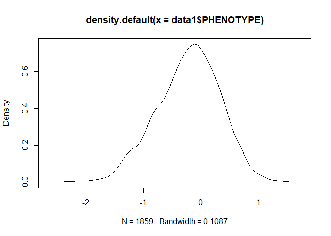
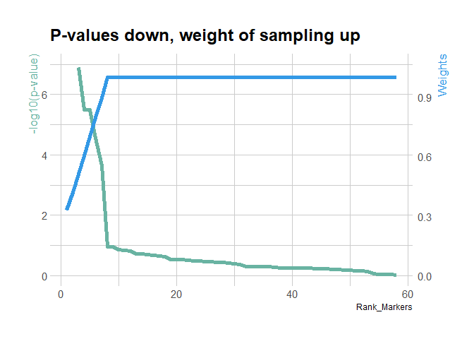
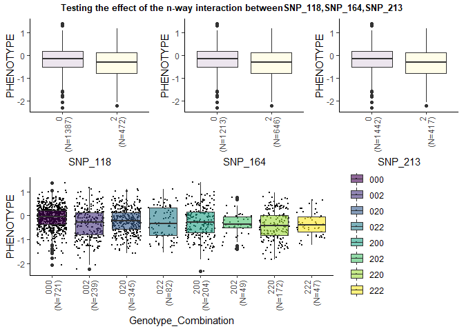
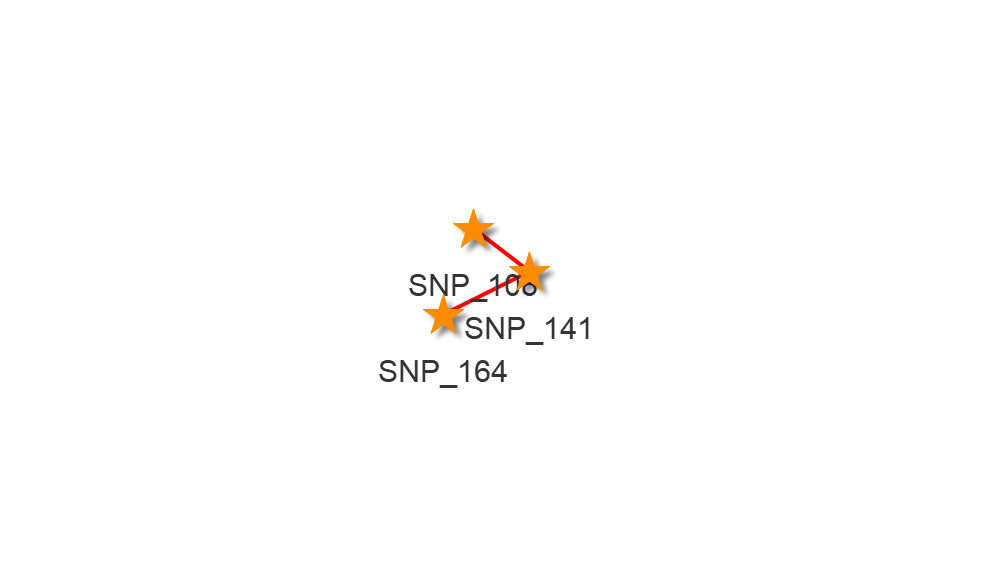
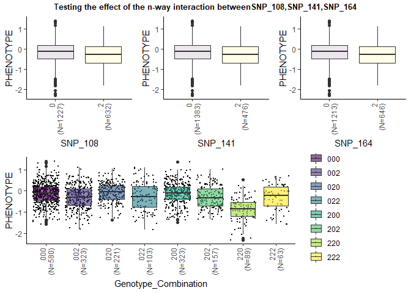
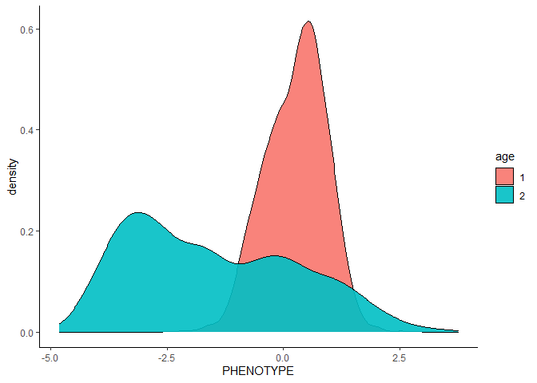
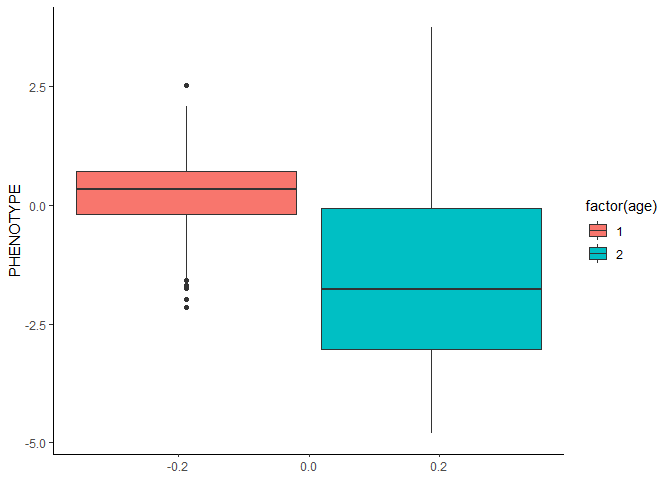
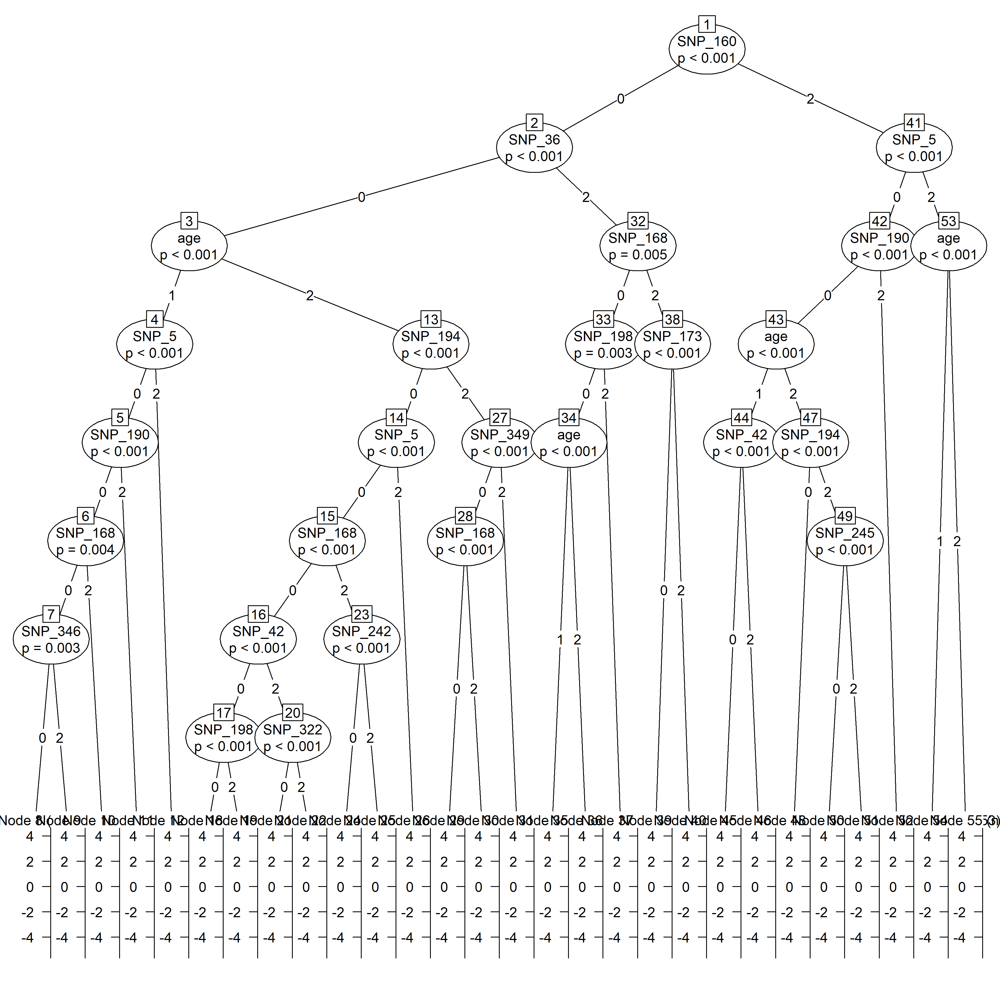
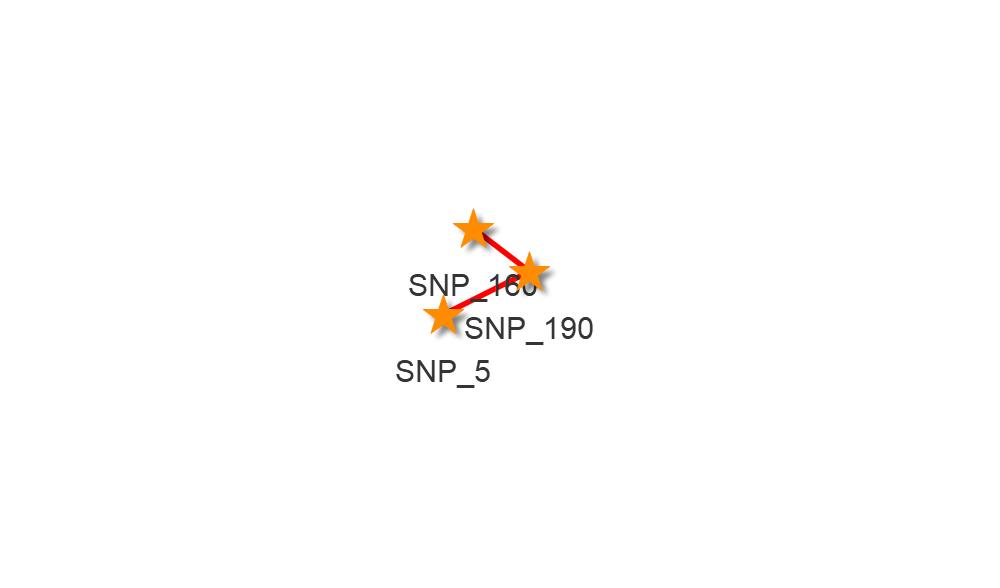
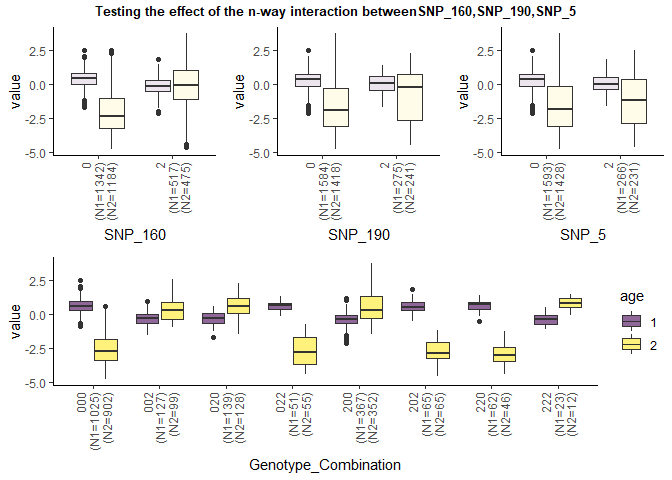

## Welcome to GitHub Pages

You can use the [editor on GitHub](https://github.com/saswatisaha18/epi-MEIF/edit/gh-pages/index.md) to maintain and preview the content for your website in Markdown files.

Whenever you commit to this repository, GitHub Pages will run [Jekyll](https://jekyllrb.com/) to rebuild the pages in your site, from the content in your Markdown files.

We have developed a novel approach of epistasis detection using
mixed-effect conditional inference forest model. The primary goal of our
approach is to identify the epistatic interactions networks of genetic
variants associated with the phenotypic variation from GWAS population
studies. A mixed effect conditional inference forest (MEIF) or
conditional inference forest (cforest) is fitted on a group of potential
causal SNPs set and the tree structure in the forest facilitates us to
identify n-way SNP interactions between the explanatory SNPs that
contribute to the phenotypic variability. Furthermore, we have developed
statistical approaches using max-t test and anova test to
methodologically validate the epistatic clusters from the epiMEIF and
statistically test the enrichment of the clusters. Overall, the MEIF
along with the additional testing strategies provides a generalized way
to obtain genetic variants and their higher order interactions from any
GWAS data.

In this html report we illustrate how to run the cforest part of the
epiMEIF method and obtain higher order interactions from different types
of dataset (cross-sectional dataset/longitudinal). We will also
illustrate ways to validate the interactions obtained from MEIF using
the additional testing strategies- max-t test and anova test and obtain
the final interaction network. Finally we show how the MEIF function in
the epiMEIF method can be executed which combined the mixed effects
modelling with cforest.


# 1. Cross-sectional Dataset

We have created a cross-sectional dataset using the DGRP dataset where
there is one 3-way SNP interaction and 4 marginal effects. The data
comprises 50 other SNPs that are not associated with the simulated
phenotype. Showing snippets of the data. The following table shows
summary of the dataset

``` r
print(summary(data1[,1:5]))
```

    ##    PHENOTYPE       SNP_172  SNP_213  SNP_164  SNP_108 
    ##  Min.   :-2.3143   0:1296   0:1442   0:1213   0:1227  
    ##  1st Qu.:-0.5736   2: 563   2: 417   2: 646   2: 632  
    ##  Median :-0.1827                                      
    ##  Mean   :-0.2217                                      
    ##  3rd Qu.: 0.1578                                      
    ##  Max.   : 1.4028

``` r
#0: minor allele,  2:major allele
dim(data1)
```

    ## [1] 1859   59

``` r
print(data1[1:10,1:9])
```

    ##       PHENOTYPE SNP_172 SNP_213 SNP_164 SNP_108 SNP_12 SNP_141 SNP_118 SNP_37
    ## 1  -0.777478227       2       2       0       0      0       0       2      0
    ## 2  -1.412565704       2       2       0       0      0       0       2      0
    ## 3  -0.307164519       2       2       0       0      0       0       2      0
    ## 4   0.369804075       2       2       0       0      0       0       2      0
    ## 5  -0.897960769       2       2       0       0      0       0       2      0
    ## 6  -1.122522073       2       2       0       0      0       0       2      0
    ## 7  -0.489949571       2       2       0       0      0       0       2      0
    ## 8   0.398216433       2       2       0       0      0       0       2      0
    ## 9  -0.006542726       0       0       0       0      0       0       0      0
    ## 10 -0.485470439       0       0       0       0      0       0       0      0

``` r
plot(density(data1$PHENOTYPE))
```



## Weighted cforest application

As already mentioned in our article, we prefer to apply the weighted
epiMEIF for the cross-sectional dataset instead of the epiMEIF approach
so that the epistatic interactions are not biased towards markers with
low pvalues or high marginal effect.We have shown the application of
weighted cforest for the cross-sectional dataset in the following
section.

How to compute the weights?

We compute the single GWAS pvalues of each marker based on a single
locus association test(using LMM) and assign higher weights to markers
with lower significance. We assign constant weight to all markers with
significance above 10%. The following chunk shows a plot illustrating
the relationship between the single GWAS p-values and the weights
assigned to each markers.

``` r
Single_Marker_Significance <- sapply( setdiff( colnames(data1), c("PHENOTYPE")), 
                              function(snp){
                              fit <- lm( as.formula( paste("PHENOTYPE~", snp, sep="")),data=data1);
                              t <- anova( fit);                       
                              return( t$`Pr(>F)`[1])})

Single_Marker_Significance <- unlist( Single_Marker_Significance)
##Setting up the parameters. We take 50 trees based on the size of our dataset. This will vary depending on the dataset. n denotes the total number of markers and q denote the number of variables sampled for creating each node in the random forest.
ntree=50
n=length(Single_Marker_Significance)
q=round(ntree/3,0)

Single_Marker_Significance <- data.frame( pvalue=Single_Marker_Significance,                                        Rank_Markers=rank(Single_Marker_Significance))

Single_Marker_Significance <- Single_Marker_Significance[ order( Single_Marker_Significance$Rank_Markers),]
max_ind <- which( Single_Marker_Significance$pvalue > 0.1)[1]
Single_Marker_Significance$weights<- Single_Marker_Significance$weights1<-  rep(1, nrow(Single_Marker_Significance))  

#Assigning ranks to the top n-q+1 markers. The intuition behind designing the following weight is explained in the article.
Single_Marker_Significance$weights[1:(n-q+1)]<- sapply(1:(n-q+1),
                                                function(i) as.numeric(comboCount(n-i, q-1)/comboCount(n,q)))

#We assign same weight to all markers with pvalues>0.1.
Single_Marker_Significance$weights[(max_ind+1):n]<- Single_Marker_Significance$weights[(max_ind)]
Single_Marker_Significance$weights1[1:max_ind] <- (log(1/Single_Marker_Significance$weights[1:(max_ind)])/max(log(1/Single_Marker_Significance$weights[1:(max_ind)]))) 
Single_Marker_Significance$weights1[(max_ind+1):n] <- Single_Marker_Significance$weights1[(max_ind+1)]
    
weight_variable <- Single_Marker_Significance$weights1
Single_Marker_Significance$weights <- weight_variable

#Plotting the weights and the p-values
temperatureColor <- "#69b3a2"
priceColor <- rgb(0.2, 0.6, 0.9, 1)

ggplot(Single_Marker_Significance, aes(x=Rank_Markers)) +
  geom_line( aes(y=-log10(pvalue)),size=2, color=temperatureColor) + 
  geom_line( aes(y=weights1*6.57), size=2, color=priceColor) +
  scale_y_continuous(
    # Features of the first axis
    name = "-log10(p-value)", limit=c(0,7),
    # Add a second axis and specify its features
    sec.axis = sec_axis(~.*(1/6.57), name="Weights")) + 
  theme_ipsum() +
  theme(
    axis.title.y = element_text(color = temperatureColor, size=13),
    axis.title.y.right = element_text(color = priceColor, size=13)) +
  ggtitle("P-values down, weight of sampling up")
```



``` r
names(weight_variable)<- rownames(Single_Marker_Significance)
weight_variable <- weight_variable[match(colnames(data1)[-1], names(weight_variable))]
```

Once the weights are designed we are ready to run the cforests on our
dataset. Note that the forest are based on bagging algoritms, so the
interaction sets (n-way snp interactions, where n\>2) may vary from one
forest to another depending on the set of variables sampled for the tree
construction in each forest. So we run the the random forest 10 times
and obtain only the interactions that are stable across all the forests
or that occur in all the forest with high interaction score. The pooled
interaction score from the 10 forests gives the average interaction
score for each interaction.The Median_Forest_Score gives a median of the
interaction scores across all the forests. It depends on at the
discretion of the user as to what threshold to use for the
Median_Forest_Score in their dataset. We prefer to select those
interactions for future analysis that appear in atleast 90% of the
forests (9/10 forests). The following table shows a subset of list of
interactions from the MEIF and their scores in each forest and over all
the forests.

    ##                   Node1   Node2   Node3 Node4 Node5 Node6 Node7 Node8 Node9
    ## Interaction_570 SNP_118 SNP_172 SNP_213                                    
    ## Interaction_70  SNP_141 SNP_172 SNP_213                                    
    ## Interaction_632 SNP_118 SNP_141 SNP_213                                    
    ## Interaction_45  SNP_164 SNP_172 SNP_213                                    
    ## Interaction_74  SNP_141 SNP_164 SNP_213                                    
    ## Interaction_34  SNP_118 SNP_164 SNP_213                                    
    ##                 Forest_1 Forest_2 Forest_3 Forest_4 Forest_5 Forest_6 Forest_7
    ## Interaction_570        4        2        4        7        5        5        5
    ## Interaction_70         5        6        5        6        5        4        5
    ## Interaction_632        5        4        8        9        5        3        5
    ## Interaction_45         6        4        3        7        6        3        2
    ## Interaction_74         7        5        4        6        6        3        4
    ## Interaction_34         8        3        5        5        7        4       10
    ##                 Forest_8 Forest_9 Forest_10 Median_Forest_Score len_interaction
    ## Interaction_570        4        1         7                 4.5               3
    ## Interaction_70         1        3         6                 5.0               3
    ## Interaction_632        2        2         5                 5.0               3
    ## Interaction_45         3        6         8                 5.0               3
    ## Interaction_74         4        5         4                 4.5               3
    ## Interaction_34         4        7         1                 5.0               3

## Validating the interactions

For each n-way interaction we test using linear regression/anova if
there is any gain in likelihood on considering n-way SNP interactions in
the model over just considering the additive effect of the n SNPs. For
instance, for the 3 way interaction between SNP_118, SNP_164, SNP_213 we
test the following:



    ## Analysis of Variance Table
    ## 
    ## Model 1: PHENOTYPE ~ SNP_118 + SNP_164 + SNP_213
    ## Model 2: PHENOTYPE ~ Genotype_Combination
    ##   Res.Df    RSS Df Sum of Sq Pr(>Chi)  
    ## 1   1855 530.48                        
    ## 2   1851 526.72  4    3.7666  0.01018 *
    ## ---
    ## Signif. codes:  0 '***' 0.001 '**' 0.01 '*' 0.05 '.' 0.1 ' ' 1

We consider only those interactions where the anova p-value is less than
5%. Here, in particular we selected the top 3 interactions that had very
satisfactory anova results and showed the final interaction network. We
also show the effect of interaction on the phenotype for each 3-way
interaction.



    ## Analysis of Variance Table
    ## 
    ## Model 1: PHENOTYPE ~ SNP_108 + SNP_141 + SNP_164
    ## Model 2: PHENOTYPE ~ Genotype_Combination
    ##   Res.Df    RSS Df Sum of Sq  Pr(>Chi)    
    ## 1   1855 534.74                           
    ## 2   1851 497.22  4    37.517 < 2.2e-16 ***
    ## ---
    ## Signif. codes:  0 '***' 0.001 '**' 0.01 '*' 0.05 '.' 0.1 ' ' 1

# 2. Longitudinal Dataset

We have created a longitudinal dataset using the DGRP dataset where
there is one 3-way SNP interaction and 4 marginal effects. The data
comprises 50 other SNPs that are not associated with the simulated
phenotype. Showing snippets of the data. The following table shows
summary of the dataset

``` r
data2[ ,setdiff(colnames(data2), c("PHENOTYPE", "age"))]<- sapply(setdiff(colnames(data2), c("PHENOTYPE", "age")), function(coln)revalue(data2[[coln]],c("1"="0", "2"="2")))

data2[ ,setdiff(colnames(data2), c("PHENOTYPE", "age"))]<- lapply(data2[ ,setdiff(colnames(data2), c("PHENOTYPE", "age"))], as.factor)

print(summary(data2[,1:15]))
```

    ##    PHENOTYPE       age      SNP_3    SNP_42   SNP_36   SNP_168  SNP_5   
    ##  Min.   :-4.8122   1:1859   0:3211   0:2333   0:2565   0:2611   0:3021  
    ##  1st Qu.:-1.6261   2:1659   2: 307   2:1185   2: 953   2: 907   2: 497  
    ##  Median :-0.1169                                                        
    ##  Mean   :-0.5684                                                        
    ##  3rd Qu.: 0.5965                                                        
    ##  Max.   : 3.7458                                                        
    ##  SNP_190  SNP_160  SNP_27   SNP_2    SNP_14   SNP_15   SNP_26   SNP_33  
    ##  0:3002   0:2526   0:3103   0:3117   0:2865   0:3083   0:2942   0:2389  
    ##  2: 516   2: 992   2: 415   2: 401   2: 653   2: 435   2: 576   2:1129  
    ##                                                                         
    ##                                                                         
    ##                                                                         
    ## 

``` r
#0: minor allele,  2:major allele
dim(data2)
```

    ## [1] 3518   60

``` r
print(data2[1:10,1:15])
```

    ##     PHENOTYPE age SNP_3 SNP_42 SNP_36 SNP_168 SNP_5 SNP_190 SNP_160 SNP_27
    ## 1   0.5222960   1     0      0      0       0     0       0       0      0
    ## 2   0.3328411   1     0      0      0       0     0       0       0      0
    ## 3   0.6944427   1     0      0      0       0     0       0       0      0
    ## 4   0.9852337   1     0      0      0       0     0       0       0      0
    ## 5   0.4018134   1     0      0      0       0     0       0       0      0
    ## 6   0.6228847   1     0      0      0       0     0       0       0      0
    ## 7   0.5116577   1     0      0      0       0     0       0       0      0
    ## 8   1.0136461   1     0      0      0       0     0       0       0      0
    ## 9  -3.1853102   2     0      0      0       0     0       0       0      0
    ## 10 -4.3266246   2     0      0      0       0     0       0       0      0
    ##    SNP_2 SNP_14 SNP_15 SNP_26 SNP_33
    ## 1      0      0      0      0      2
    ## 2      0      0      0      0      2
    ## 3      0      0      0      0      2
    ## 4      0      0      0      0      2
    ## 5      0      0      0      0      2
    ## 6      0      0      0      0      2
    ## 7      0      0      0      0      2
    ## 8      0      0      0      0      2
    ## 9      0      0      0      0      2
    ## 10     0      0      0      0      2

``` r
ggplot(data2, aes(x = PHENOTYPE, fill = age)) + geom_density(alpha = 0.9) + theme_classic()
```



``` r
ggplot(data2, aes(y = PHENOTYPE, fill = factor(age))) + geom_boxplot() + theme_classic()
```



``` r
source(file.path(SCRIPT_DIR, "Interactions_Score_Ageing.R"))
```

## How to run a cforest on the longitudinal data and obtain interactions?

``` r
Importance_Score <- list()

##Parameters we use for the random forest
ntree=50
q=round(ntree/3,0)
mincriterion=0.95
minsplit = 30
minbucket = 30

addq <- function(x) paste0("`", x, "`")
fit.rf.formula <-  as.formula( paste(" PHENOTYPE ~(", paste( addq(setdiff(colnames(data2), c("PHENOTYPE"))), collapse = "+"), ")"))

set.seed(100)
##Running the epiforest
fit.rf <-partykit::cforest( fit.rf.formula, data = data2, mtry = round(ntree/3,0), ntree = ntree, control = ctree_control(teststat="quad", testtype="Univ", mincriterion=0.95, minsplit = 30, minbucket = 30)) 
##Plotting a sample  tree from the forest.  
cat("Fitting the cforest\n\n")
```

    ## Fitting the cforest

``` r
print(fit.rf.formula)
```

    ## PHENOTYPE ~ (age + SNP_3 + SNP_42 + SNP_36 + SNP_168 + SNP_5 + 
    ##     SNP_190 + SNP_160 + SNP_27 + SNP_2 + SNP_14 + SNP_15 + SNP_26 + 
    ##     SNP_33 + SNP_40 + SNP_61 + SNP_73 + SNP_78 + SNP_95 + SNP_97 + 
    ##     SNP_102 + SNP_108 + SNP_111 + SNP_116 + SNP_117 + SNP_130 + 
    ##     SNP_138 + SNP_144 + SNP_151 + SNP_162 + SNP_169 + SNP_172 + 
    ##     SNP_173 + SNP_175 + SNP_184 + SNP_186 + SNP_194 + SNP_198 + 
    ##     SNP_233 + SNP_242 + SNP_243 + SNP_245 + SNP_254 + SNP_260 + 
    ##     SNP_267 + SNP_271 + SNP_290 + SNP_295 + SNP_317 + SNP_322 + 
    ##     SNP_334 + SNP_336 + SNP_346 + SNP_349 + SNP_350 + SNP_356 + 
    ##     SNP_358 + SNP_362 + SNP_366)

``` r
cat("Plotting a sample tree from the cforest\n\n")
```

    ## Plotting a sample tree from the cforest

``` r
plot(gettree(fit.rf,tree=15))
```



``` r
cat("Possible interactions from the above tree ")
```

    ## Possible interactions from the above tree

``` r
cat("SNP_160, SNP_5, SNP_190\n\n", "SNP_160, SNP_5\n\n", "SNP_160, SNP_36\n\n", "SNP_160, SNP_36, SNP_168, SNP_198\n\n")
```

    ## SNP_160, SNP_5, SNP_190
    ## 
    ##  SNP_160, SNP_5
    ## 
    ##  SNP_160, SNP_36
    ## 
    ##  SNP_160, SNP_36, SNP_168, SNP_198

``` r
##computing the SNP interaction metric for each forest run.
Importance_Score <-getInteractionMatrix(fit.rf)
##print the SNP interaction metric from one such forest run.
print(tail(Importance_Score[[2]], n=20))
```

    ##    Node1   Node2   Node3   Node4 Node5 Node6 Node7 Node8 Forest_Score
    ## 35   age SNP_194 SNP_160                                            3
    ## 38   age  SNP_36   SNP_3                                            3
    ## 15   age SNP_190   SNP_5 SNP_160                                    4
    ## 43   age SNP_160 SNP_168  SNP_36                                    4
    ## 61   age SNP_168 SNP_190 SNP_160                                    4
    ## 40   age SNP_160   SNP_3                                            5
    ## 49   age   SNP_3 SNP_160                                            5
    ## 2    age  SNP_42 SNP_160                                            7
    ## 62   age SNP_190 SNP_160                                            7
    ## 3    age   SNP_3                                                    9
    ## 6    age   SNP_5 SNP_160                                            9
    ## 21   age SNP_190                                                    9
    ## 58   age  SNP_42                                                    9
    ## 27   age  SNP_36 SNP_160                                           11
    ## 37   age SNP_160  SNP_36                                           11
    ## 29   age SNP_160 SNP_168                                           13
    ## 51   age SNP_168 SNP_160                                           13
    ## 16   age  SNP_36                                                   15
    ## 41   age SNP_168                                                   17
    ## 33   age SNP_160                                                   27

## How to run a MEIF on the longitudinal data and obtain interactions?

Since the random forest is a bagging based algorithm the set of
interactions shown above may vary from one forest run to another. So we
run the the random forest 10 times and obtain only the interactions that
are stable across all the forests or that occur in all the forest with
high interaction score. The pooled interaction score from the 10 forests
gives the average interaction score for each interaction.The
Median_Forest_Score gives a median of the interaction scores across all
the forests. It depends on at the discretion of the user as to what
threshold to use for the Median_Forest_Score in their dataset. In the
data example, we have kept all the interactions with positive median
forest score. Few interactions with top scores from MEIF is ahown below.

    ##       Node1   Node2   Node3 Node4 Forest_1 Forest_2 Forest_3 Forest_4 Forest_5
    ## 189 SNP_160 SNP_190  SNP_36 SNP_5        0        1        2        0        1
    ## 7   SNP_160 SNP_168   SNP_3              7        7        0        2        0
    ## 352 SNP_160 SNP_168 SNP_190              0        0        0        6        6
    ## 33  SNP_160  SNP_36  SNP_42              6        0        0        0        3
    ## 301 SNP_160 SNP_190   SNP_5              0        0        7        7        8
    ##     Forest_6 Forest_7 Forest_8 Forest_9 Forest_10 Median_Forest_Score
    ## 189        3        0        1        0         0                 0.5
    ## 7          0        6        0        6         0                 1.0
    ## 352        7        5        5        0         0                 2.5
    ## 33         4        0        3        3         5                 3.0
    ## 301        5        6        6        3         5                 5.5
    ##     len_interaction
    ## 189               4
    ## 7                 3
    ## 352               3
    ## 33                3
    ## 301               3

## Validating the interactions

For each n-way interaction we perform a anova test and a max t-test. We
only consider those interactions that satisfy one of the above test
(i.e. p-value significant from one of the above test).

### Validating a set of N-way interactions using Max-T test

<div class="b--gray ba bw2 ma2 pa4 shadow-1">

Step 1: Randomly draw any N SNPs from the whole genome (n times, 1000 in
our case).

Step 2: For each N-way SNP set compute and evaluate the Max-T test using
the following:

a: *N* SNP interaction give rise to 2<sup>*N*</sup> genotype
combinations denoted by the set *G* = {1, ⋯, 2<sup>*N*</sup>}.

b: Fit the regression:
(*Y*<sub>*i*</sub>(*t*) = *β*<sub>*i*</sub>*t* + *α* + *ϵ*), where
*i* ∈ *G*,*Y*<sub>*i*</sub>(*t*) denote the phenotype of the population
having genotype *i* at time point *t* and *β*<sub>*i*</sub> capture the
effect of the genotype *i* on the longitudinal variation of the
phenotype.

Note that we assume that the genotype combination 1 as the baseline here
denoting the combination arising from the interactions of major alleles.
For instance for the DGRP data, SNP value 0 denote the major allele and
1 in G denote the combinations with all 0’s. c: We test the following to
asses if the effect of any alternative genotype combination is
significantly different from the major allele combination:
*H*<sub>0</sub> : (*β*<sub>*i*</sub> − *β*<sub>1</sub>) = 0, *f**o**r* *a**l**l* *c**o**m**b**i**n**a**t**i**o**n* *i* ∈ *G* ∖ {1}
*H*<sub>1</sub> : (*β*<sub>*i*</sub> − *β*<sub>1</sub>) ≠ 0, *f**o**r* *s**o**m**e* *c**o**m**b**i**n**a**t**i**o**n* *i* ∈ *G* ∖ {1}

The test statististics used to evaluate the above:
*T*<sub>*m**a**x*</sub> = *m**a**x*(*T*<sub>2</sub>, ........*T*<sub>(2<sup>*N*</sup>)</sub>)
where *T*<sub>*i*</sub> is statistics computing the difference in effect
of the alternative genotype from the baseline genotype on the
longitudinal variation of the phenotype.
$$T_i=\\frac{\\hat{\\beta}\_i  -\\hat{\\beta}\_1}{se(\\hat{\\beta}\_i+\\hat{\\beta}\_1)} =\\frac{\\hat{\\beta}\_i  -\\hat{\\beta}\_1}{\\sqrt{se^2(\\hat{\\beta}\_i)+se^2(\\hat{\\beta}\_1)} }$$
Note that *β̂*<sub>*i*</sub>’s are indenpendant for all i. We have
already shown in the article that under *H*<sub>0</sub>,
$$T=\\begin{pmatrix}T_1 \\\\
                     T_2 \\\\
                     \\vdots\\\\
                     \\end{pmatrix}\\sim {N}\\Bigg{(}\\begin{pmatrix} 0\\\\
                                                             0\\\\
                                                             \\vdots\\\\
                                                             \\end{pmatrix},
                              R= \\begin{pmatrix}1 & 1/2 & \\cdots\\\\
                                                1/2 & 1 & \\cdots\\\\                                             
                                                \\vdots\\\\
                                                \\end{pmatrix}\\Bigg{)}$$

One can easily compute the pvalue
*P*<sub>*H*<sub>0</sub></sub>(*T*<sub>*m**a**x*</sub> \> *t*<sub>*o**b**s*<sub>*m**a**x*</sub></sub>)
using the above distribution.

Step 3: Compute p-values for the epistasis set and the N-way SNP
collections and check if:

No of times p-values(Random SNPs groups) \< p-value(Epistasis set).

</div>

    ## <BR><BR> The table below shows a part of SNP interaction table that satisfy either max-t test or anova test <BR><BR>.

    ##       Node1   Node2   Node3 Node4 Forest_1 Forest_2 Forest_3 Forest_4 Forest_5
    ## 189 SNP_160 SNP_190  SNP_36 SNP_5        0        1        2        0        1
    ## 7   SNP_160 SNP_168   SNP_3              7        7        0        2        0
    ## 352 SNP_160 SNP_168 SNP_190              0        0        0        6        6
    ## 33  SNP_160  SNP_36  SNP_42              6        0        0        0        3
    ## 301 SNP_160 SNP_190   SNP_5              0        0        7        7        8
    ##     Forest_6 Forest_7 Forest_8 Forest_9 Forest_10 Median_Forest_Score
    ## 189        3        0        1        0         0                 0.5
    ## 7          0        6        0        6         0                 1.0
    ## 352        7        5        5        0         0                 2.5
    ## 33         4        0        3        3         5                 3.0
    ## 301        5        6        6        3         5                 5.5
    ##     len_interaction maxt_pvalue        lrpval
    ## 189               4           0  0.000000e+00
    ## 7                 3           0  3.855945e-30
    ## 352               3           0 2.641436e-127
    ## 33                3           0  1.895065e-09
    ## 301               3           0  0.000000e+00

## Plotting the best interaction from our interaction table



    ## Analysis of Variance Table
    ## 
    ## Model 1: value ~ age * SNP_160 + SNP_190 + SNP_5
    ## Model 2: value ~ age * Genotype_Combination
    ##   Res.Df    RSS Df Sum of Sq  Pr(>Chi)    
    ## 1   3512 4950.6                           
    ## 2   3502 2004.9 10    2945.7 < 2.2e-16 ***
    ## ---
    ## Signif. codes:  0 '***' 0.001 '**' 0.01 '*' 0.05 '.' 0.1 ' ' 1

# 3. MEIF Implementation

In this section we will show how to combine mixed effects modelling with
cforest in MEIF (model shown below).

*y*<sub>*i*</sub> = ∑*a*<sub>*i*</sub>*X*<sub>*i**j*</sub> + *b*<sub>*i*</sub>*Z*<sub>*i*</sub> + *f*(*S*<sub>*i*1</sub>, *S*<sub>*i*2</sub>, ⋯, *S*<sub>*i**N*</sub>) + *ϵ*<sub>*i*</sub>
where
*b*<sub>*i*</sub> ∼ *N*<sub>*q*</sub>(0, *D*), *ϵ*<sub>*i*</sub> ∼ *N*<sub>*n*<sub>*i*</sub></sub>(0, *R*<sub>*i*</sub>), *i* = 1, ⋯, *n*, *j* = 1, ⋯, *K*.

See the Methods and Materials of the article for more details on the
different component of the above model. We have already shown how to run
the cforest (represented by *f* in the above function) and extract
interactions from cforest in the above two sections. Here we show how
can we implement the mixed effects conditional inference forest (MEIF),
that is particularly useful when we have additional covariates except
genotype data in the model like population structure or hidden
covariates that might have an impact on the phenotype. For the DGRP
dataset, there exist some bacterial infections called Wolbachia
infections that might have an effect on the phenotype. Additionally,
there are chromosomal inversions that are a ubiquitous feature of
genetic variation. While inversions have been shown previously to be
under selection, or contain genetic variation under selection, the
specific phenotypic consequences of inversions leading to their
maintenance remain unclear. We take into account the inversions that
have quantifiable effect on the phenotype.

Hence, for the DGRP simulated data, apart from capturing the effect of
the genotype on the phenotype and detecting the genetic interactions, we
would also like to capture the effect of wolbachia and the above
mentioned inversions. We have shown below how the different component
can be coded in the MEIF function. Note that function *f* (or the
cforest operation) is parallelized in MEIF for faster implementation.

``` r
#Reading the MEIF function
source( file.path( SCRIPT_DIR, "MEIF.R"))
train <- data3
# For our dataset the last 18 columns contains the variable that should be considered in the mixed model (outside the random forest)
cols_mixed <- c( "strain", colnames(train)[61:77])
cols_random <- cols_mixed[1]
cols_fixed <- cols_mixed[-1]
# They are
print(cols_fixed)
```

    ##  [1] "wolbachia.effect"   "inversion.effect1"  "inversion.effect2" 
    ##  [4] "inversion.effect3"  "inversion.effect4"  "inversion.effect5" 
    ##  [7] "inversion.effect6"  "inversion.effect7"  "inversion.effect8" 
    ## [10] "inversion.effect9"  "inversion.effect10" "inversion.effect11"
    ## [13] "inversion.effect12" "inversion.effect13" "inversion.effect14"
    ## [16] "inversion.effect15" "inversion.effect16"

``` r
# We want to capture the effect due to strain as random effect and the rest (due to the infection status and inversions as fixed effects in the model). 
train[ cols_mixed] <- lapply( train[ cols_mixed], function(i)factor(i))

cols = setdiff(colnames( train)[ -1], cols_mixed)
train[ cols] <- lapply( train[ cols], function(i)factor(i,ordered=TRUE))
gc(verbose=TRUE)
```

    ##           used  (Mb) gc trigger  (Mb) max used  (Mb)
    ## Ncells 3420028 182.7    5808438 310.3  5808438 310.3
    ## Vcells 8610344  65.7   14787904 112.9 14787904 112.9

``` r
set.seed( 415)

#######################Defining the variables for calling MEIF###########################################
xnam = train[,setdiff( colnames(train), c("PHENOTYPE",cols_mixed))]
print(dim(xnam))
```

    ## [1] 1859   58

``` r
#redifining the strains as cluster.id
colnames(train)[ colnames(train)=="strain"] = "cluster.id"
MERF.lDB = train
colnames(MERF.lDB)[ colnames(MERF.lDB)=="PHENOTYPE"] = "Y"
Snp_List <- colnames( xnam)[-1]

colnames(MERF.lDB)[colnames(MERF.lDB) %in% Snp_List] <- colnames(xnam)[colnames(xnam) %in% Snp_List] <- sapply(1:length(Snp_List),function(i)paste("SNP",i,sep=""))
Snp_Map <- cbind( Snp_List, sapply(1:length(Snp_List),function(i)paste("SNP",i,sep="")))
print(dim(MERF.lDB))
```

    ## [1] 1859   77

``` r
print(head(Snp_Map))
```

    ##      Snp_List        
    ## [1,] "SNP_101" "SNP1"
    ## [2,] "SNP_36"  "SNP2"
    ## [3,] "SNP_110" "SNP3"
    ## [4,] "SNP_190" "SNP4"
    ## [5,] "SNP_104" "SNP5"
    ## [6,] "SNP_11"  "SNP6"

``` r
ni = vector()
train$cluster.id = factor( train$cluster.id, labels = 1:nlevels( train$cluster.id))
#ni captures the cardinality of each cluster
ni = table(train$cluster.id)

#Zi is the matrix of random effect covariate
Zi = lapply( 1:nlevels( train$cluster.id), function(i) as.matrix( rep(1, ni[i])))

#Yi is the vector of responses
Yi = lapply( 1:nlevels( train$cluster.id), function(i) as.matrix((train[,c("cluster.id","PHENOTYPE")]%>%filter(cluster.id==i))$PHENOTYPE))

#Xi is the matrix of fixed effect covariates. We first model the different Fixed effect covrariates in I and then combined them in X.
Ii = lapply( levels( train$cluster.id), function(i) do.call("cbind", lapply( cols_fixed,function(j) { ddata = train[,c("cluster.id",cols_fixed)]; diag(nlevels(ddata[ ddata$cluster.id==i, ][[j]]))[ddata[ ddata$cluster.id==i, ][[j]], ]})))
Xi = lapply( 1:nlevels( train$cluster.id), function(i)  Ii[[i]])

#Parameters of the random forest
mtry = round( ncol( MERF.lDB)/3,0)
ntree = 50
nodesize = 5

#other parameters for MEIF
sigmasqzero = NULL
Dzero = NULL
bizero = NULL
cizero = NULL

F.niter = 10
max.niter = 30
smallest.Jump.allowed = 1e-1

verbose = TRUE
output <- list()
set.seed( 100)

#######################Running the MEIF###########################################

system.time(output<-MEIF(xnam,
                        MERF.lDB,
                         ni,
                         Zi,
                         Yi,
                         Xi,                                                                                                                                  ntree=ntree,
                         mtry=mtry,
                         nodesize,
                         sigmasqzero = NULL,
                         Dzero = NULL,
                         bizero = NULL,
                         cizero = NULL,
                         weight_variable = c(0, rep(1/length(cols), length(cols))),
                         F.niter,
                         max.niter,
                         smallest.Jump.allowed,
                         threads=4,
                         verbose = TRUE))
```

    ## R Version:  R version 4.0.2 (2020-06-22)

    ##    user  system elapsed 
    ##   73.50   14.55  315.64

``` r
print(summary(output))
```

    ##                  Length Class   Mode   
    ## Jump[r]            1    -none-  numeric
    ## GLL               11    -none-  numeric
    ## convergence.iter  11    -none-  numeric
    ## fit.rf             8    cforest list   
    ## bi[[r]]          162    -none-  list   
    ## ci[[r]]           35    -none-  numeric
    ## sigma.sq[r]        1    -none-  numeric
    ## D                 11    -none-  list

``` r
#The fit.rf comprises the cforest implementation part of the MEIF and the fit.rf object can be used for extracting interactions as shown earlier in the 1st and 2nd section.
```
